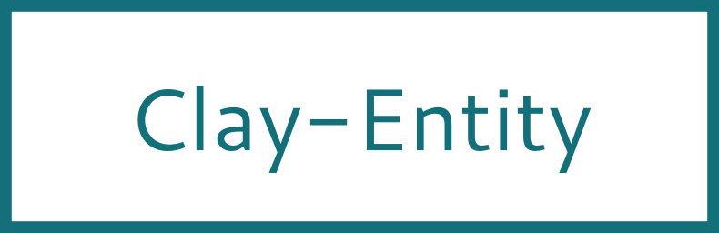

 


<!---
This file is generated by ape-tmpl. Do not update manually.
--->

<!-- Badge Start -->
<a name="badges"></a>

[![Build Status][bd_travis_shield_url]][bd_travis_url]
[![npm Version][bd_npm_shield_url]][bd_npm_url]
[![JS Standard][bd_standard_shield_url]][bd_standard_url]

[bd_repo_url]: https://github.com/realglobe-Inc/clay-entity
[bd_travis_url]: http://travis-ci.org/realglobe-Inc/clay-entity
[bd_travis_shield_url]: http://img.shields.io/travis/realglobe-Inc/clay-entity.svg?style=flat
[bd_travis_com_url]: http://travis-ci.com/realglobe-Inc/clay-entity
[bd_travis_com_shield_url]: https://api.travis-ci.com/realglobe-Inc/clay-entity.svg?token=
[bd_license_url]: https://github.com/realglobe-Inc/clay-entity/blob/master/LICENSE
[bd_codeclimate_url]: http://codeclimate.com/github/realglobe-Inc/clay-entity
[bd_codeclimate_shield_url]: http://img.shields.io/codeclimate/github/realglobe-Inc/clay-entity.svg?style=flat
[bd_codeclimate_coverage_shield_url]: http://img.shields.io/codeclimate/coverage/github/realglobe-Inc/clay-entity.svg?style=flat
[bd_gemnasium_url]: https://gemnasium.com/realglobe-Inc/clay-entity
[bd_gemnasium_shield_url]: https://gemnasium.com/realglobe-Inc/clay-entity.svg
[bd_npm_url]: http://www.npmjs.org/package/clay-entity
[bd_npm_shield_url]: http://img.shields.io/npm/v/clay-entity.svg?style=flat
[bd_standard_url]: http://standardjs.com/
[bd_standard_shield_url]: https://img.shields.io/badge/code%20style-standard-brightgreen.svg

<!-- Badge End -->


<!-- Description Start -->
<a name="description"></a>

Entity class for ClayDB

<!-- Description End -->


<!-- Overview Start -->
<a name="overview"></a>


<!-- Overview End -->


<!-- Sections Start -->
<a name="sections"></a>

<!-- Section from "doc/guides/01.Installation.md.hbs" Start -->

<a name="section-doc-guides-01-installation-md"></a>

Installation
-----

```bash
$ npm install clay-entity --save
```


<!-- Section from "doc/guides/01.Installation.md.hbs" End -->

<!-- Section from "doc/guides/02.Usage.md.hbs" Start -->

<a name="section-doc-guides-02-usage-md"></a>

Usage
---------

```javascript
'use strict'

const clayEntity = require('clay-entity')

{
  let entity01 = clayEntity({
    title: 'Wonderful Banana'
  })
  console.log(entity01)
}

```


<!-- Section from "doc/guides/02.Usage.md.hbs" End -->

<!-- Section from "doc/guides/03.API.md.hbs" Start -->

<a name="section-doc-guides-03-a-p-i-md"></a>

API
---------

# clay-entity@2.1.2

Entity class for ClayDB

+ Functions
  + [create(args)](#clay-entity-function-create)
  + [decorate(decorate)](#clay-entity-function-decorate)
  + [isEntity(obj)](#clay-entity-function-is-entity)
+ [`DecoratedEntity`](#clay-entity-class) Class
  + [new DecoratedEntity(entity)](#clay-entity-class-decorated-entity-constructor)
  + [entity.get(name)](#clay-entity-class-decorated-entity-get)
  + [entity.set(name, value)](#clay-entity-class-decorated-entity-set)
  + [entity.set(attributes, options)](#clay-entity-class-decorated-entity-set)
  + [entity.at(at)](#clay-entity-class-decorated-entity-at)
  + [entity.at()](#clay-entity-class-decorated-entity-at)
  + [entity.by(by)](#clay-entity-class-decorated-entity-by)
  + [entity.by()](#clay-entity-class-decorated-entity-by)
  + [entity.seal(privateKey)](#clay-entity-class-decorated-entity-seal)
  + [entity.seal()](#clay-entity-class-decorated-entity-seal)
  + [entity.as(as)](#clay-entity-class-decorated-entity-as)
  + [entity.as()](#clay-entity-class-decorated-entity-as)
  + [entity.num(num)](#clay-entity-class-decorated-entity-num)
  + [entity.num()](#clay-entity-class-decorated-entity-num)
  + [entity.verify(publicKey)](#clay-entity-class-decorated-entity-verify)
  + [entity.toValues()](#clay-entity-class-decorated-entity-toValues)

## Functions

<a class='md-heading-link' name="clay-entity-function-create" ></a>

### create(args) -> `Entity`

Create a Entity instance

| Param | Type | Description |
| ----- | --- | -------- |
| args | * |  |

<a class='md-heading-link' name="clay-entity-function-decorate" ></a>

### decorate(decorate) -> `DecoratedEntity`

Decorate an entity

| Param | Type | Description |
| ----- | --- | -------- |
| decorate | Entity |  |

<a class='md-heading-link' name="clay-entity-function-is-entity" ></a>

### isEntity(obj) -> `boolean`

Detect a instance is entity or not

| Param | Type | Description |
| ----- | --- | -------- |
| obj | * | Object to check |


<a class='md-heading-link' name="clay-entity-class"></a>

## `DecoratedEntity` Class


<a class='md-heading-link' name="clay-entity-class-decorated-entity-constructor" ></a>

### new DecoratedEntity(entity)

Constructor of DecoratedEntity class

| Param | Type | Description |
| ----- | --- | -------- |
| entity | Entity | Entity to decorate |


<a class='md-heading-link' name="clay-entity-class-decorated-entity-get" ></a>

### entity.get(name) -> `*`

Get entity attribute.

| Param | Type | Description |
| ----- | --- | -------- |
| name | string | Name of attribute |


<a class='md-heading-link' name="clay-entity-class-decorated-entity-set" ></a>

### entity.set(name, value) -> `DecoratedEntity`

Set value

| Param | Type | Description |
| ----- | --- | -------- |
| name | string | Name of attribute to set |
| value | * | Value to set |


<a class='md-heading-link' name="clay-entity-class-decorated-entity-set" ></a>

### entity.set(attributes, options) -> `DecoratedEntity`

Set values

| Param | Type | Description |
| ----- | --- | -------- |
| attributes | Object | Attributes to set |
| options | Object | Optional settings |
| options.allowReserved | boolean | Allow to set reserved |


<a class='md-heading-link' name="clay-entity-class-decorated-entity-at" ></a>

### entity.at(at) -> `DecoratedEntity`

Set $$at attribute

| Param | Type | Description |
| ----- | --- | -------- |
| at | Date | Date data set at |


<a class='md-heading-link' name="clay-entity-class-decorated-entity-at" ></a>

### entity.at() -> `Date`

Get $$at attribute

<a class='md-heading-link' name="clay-entity-class-decorated-entity-by" ></a>

### entity.by(by) -> `DecoratedEntity`

Set $$by attribute

| Param | Type | Description |
| ----- | --- | -------- |
| by | string | Lump id |


<a class='md-heading-link' name="clay-entity-class-decorated-entity-by" ></a>

### entity.by() -> `string`

Get $$by attribute

<a class='md-heading-link' name="clay-entity-class-decorated-entity-seal" ></a>

### entity.seal(privateKey) -> `DecoratedEntity`

Seal this entity

| Param | Type | Description |
| ----- | --- | -------- |
| privateKey | string | Private key to seal |


<a class='md-heading-link' name="clay-entity-class-decorated-entity-seal" ></a>

### entity.seal() -> `string`

Get seal

<a class='md-heading-link' name="clay-entity-class-decorated-entity-as" ></a>

### entity.as(as) -> `DecoratedEntity`

Set resource name as as

| Param | Type | Description |
| ----- | --- | -------- |
| as | string | As |


<a class='md-heading-link' name="clay-entity-class-decorated-entity-as" ></a>

### entity.as() -> `string`

Get as

<a class='md-heading-link' name="clay-entity-class-decorated-entity-num" ></a>

### entity.num(num) -> `DecoratedEntity`

Set entity number as num

| Param | Type | Description |
| ----- | --- | -------- |
| num | string | As |


<a class='md-heading-link' name="clay-entity-class-decorated-entity-num" ></a>

### entity.num() -> `string`

Get num

<a class='md-heading-link' name="clay-entity-class-decorated-entity-verify" ></a>

### entity.verify(publicKey) -> `boolean`

Verify the entity with public key

| Param | Type | Description |
| ----- | --- | -------- |
| publicKey | string |  |


<a class='md-heading-link' name="clay-entity-class-decorated-entity-toValues" ></a>

### entity.toValues() -> `Object`

Convert into value object


<!-- Section from "doc/guides/03.API.md.hbs" End -->


<!-- Sections Start -->


<!-- LICENSE Start -->
<a name="license"></a>

License
-------
This software is released under the [Apache-2.0 License](https://github.com/realglobe-Inc/clay-entity/blob/master/LICENSE).

<!-- LICENSE End -->


<!-- Links Start -->
<a name="links"></a>

Links
------

+ [ClayDB][clay_d_b_url]
+ [Realglobe, Inc.][realglobe,_inc__url]

[clay_d_b_url]: https://github.com/realglobe-Inc/claydb
[realglobe,_inc__url]: http://realglobe.jp

<!-- Links End -->
